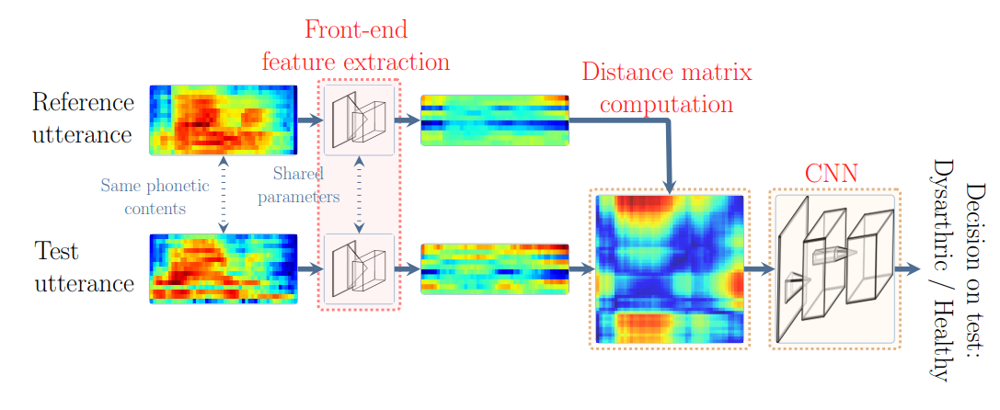

# ***Automatic Dysarthric Speech Detection Exploiting Pairwise Distance-based Convolutional Neural Networks***





## **Introduction**

This is the code release of our paper ***Automatic Dysarthric Speech Detection Exploiting Pairwise Distance-based Convolutional Neural Networks***


If you happen to use the models and code for your work, please cite the following paper

```
@INPROCEEDINGS{Janbakhshi2021ICASSP,
author={Janbakhshi, Parvaneh and Kodrasi, Ina and Bourlard, Hervé},
booktitle={IEEE International Conference on Acoustics, Speech and Signal Processing (ICASSP)},
title={Automatic Dysarthric Speech Detection Exploiting Pairwise Distance-Based Convolutional Neural Networks},
Address = {Toronto, Canada},
Month = {May},
year={2021},
pages={7328-7332},
doi={10.1109/ICASSP39728.2021.9413922}}
```

We include in this repo

* Automatic Dysarthric Speech Detection using two baseline systems and our proposed distance-based CNN approach.
    * Speech representation and distance matrix computation (database preprocessing), we included both on-the-fly and offline data preprocessing. 
    * Training/testing baseline_1 CNN, baseline_2 CNN, and our proposed distance-based CNN.

<span style="color:brown">NOTE</span>: CNN-based articulatory posteriors (AP) feature extractors are not included in this repo. For our paper we used pre-trained models from work:
* S. P. Dubagunta and M. Magimai-Doss, “Using Speech Production Knowledge for Raw Waveform Modelling Based Styrian Dialect Identification,” in In Proc. NTERSPEECH. 2019.


## **Requirements**

Python 3.7 or above
PyTorch 1.6.0 or above.
Other required packages are listed below, and also in requirements.yml:
- cudatoolkit
- joblib
- pandas
- torchaudio
- yaml
- soundfile
- tqdm


## Dataset
We tested the method on the Spanish PC-GITA database and French MoSpeeDi database using cross-fold validation paradigm, however here as a demo for feature extraction (both on-the-fly and offline), we used a **dummy database** from wav samples of "Boston University Radio Corpus Data (female speaker)".
`https://catalog.ldc.upenn.edu/LDC96S36`
`http://www.fit.vutbr.cz/~motlicek/speech_hnm.html`

To know more about the used pathological speech databases, please refer to our paper.

## **preprocessing**
For the feature extraction and preprocessing of the data, we provide the default configs file audio_config.yaml under the config/ directory.
* To preprocess the data required for baseline_1 CNN (spectrogram chunks), run preprocess.py in database directory (e.g., dummy_database), which 
    1. (optionally) segments continuous speech data for each speaker into short utterances (e.g, 8 seconds).
    2. computes and save feature representation data (for offline usage).
    3. creates table of train/test/validation folds required for both on-the-fly (e.g., {train/test/val}_fold{num}_online.csv) and offline (e.g., {train/test/val}_fold{num}_{feature_type}_offline.csv) feature extraction options.

```
python preprocess/dummy_database/preprocess.py
```
* To preprocess the isolated word utterances required for baseline_2 CNN and end2end distance-based CNN (e.g., paired representations, and distance matrices), run preprocess_distmat.py in database directory (e.g., dummy_database), which
    1. computes and save feature representation for each utterance.
    2. (temporally) resizes the feature representations to the same size.
    3. creates distance matrices from pairs of speakers' representation (considering all utterances from each speaker).
    4. creates table of train/test/validation folds required for both on-the-fly (e.g., {train/test/val}_fold{num}_isowords_online.csv) and offline (e.g., {train/test/val}_fold{num}_resized_words_{feature_type}_offline.csv and {train/test/val}_fold{num}_{feature_type}_Dist_offline.csv) feature extraction options.
```
python preprocess/dummy_database/preprocess_distmat.py
```
## **CNNs training/evaluating**

For training different CNN systems for each fold (according to our paper), we provide default config file NNtrain_config.yaml under the config/ directory to set the models architectures, and set the training and data loading parameters.

* training baseline_1 CNN:
    * in NNtrain_config.yaml set SelectedNetwork: "CNN1d" 
    * in audio_config.yaml set Pairwise-Distance: False and Pairwise-Reps: False  

* training baseline_2 CNN:
    * in NNtrain_config.yaml set SelectedNetwork: "CNN2d" 
    * in audio_config.yaml set Pairwise-Distance: True and Pairwise-Reps: False  

* training distance-based CNN:
    * in NNtrain_config.yaml set SelectedNetwork: "CNNDist" 
    * in audio_config.yaml set Pairwise-Distance: False and Pairwise-Reps: True

```
python train_CNN.py --valmonitor --mode train --fold 1
```
in case of initialization of distance-based CNN using pre-trained baseline CNNs:
```
python train_CNN.py --valmonitor --mode train --preinit --fold 1
```
For evaluating the previously saved models, use "--mode evaluation" instead of "--mode train"

Results of the experiments are saved in /results/{cnnmodel}-{expname} directory


